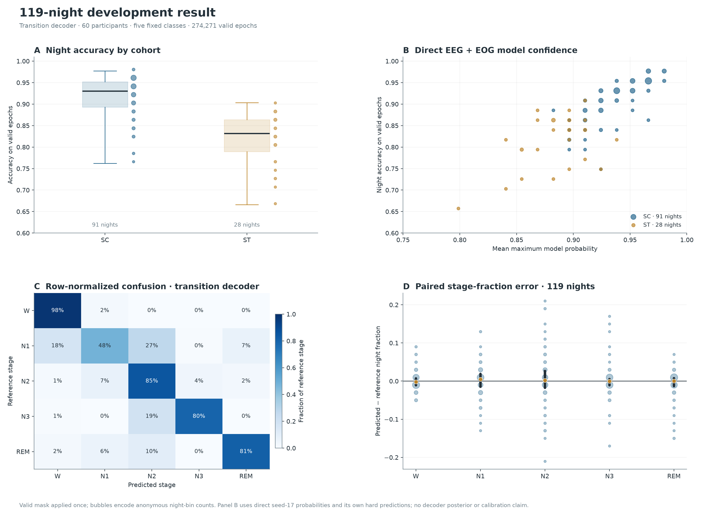

# PhysioSleep

**Reproducible sleep-staging research, with explicit evidence boundaries.**

The best completed development pipeline achieves **0.789779 pooled five-class Macro-F1** and **90.738% accuracy** on 119 recordings from 60 development participants. Its improvement over the fixed EEG+EOG control is **+0.003512 absolute**, below the required +0.02. **Audit A and Audit B are NOT_RUN. The mandatory benchmark is incomplete.**



These figures come from saved predictions. They are not generated performance illustrations. Development selection, full-record Wake prevalence and uncertainty limitations are explained in the [scientific report](docs/REPORT.md).

| Evidence | Current result |
|---|---|
| Data | 197 recording pairs / 100 participants; fixed development / A / B allocation of 60 / 20 / 20 |
| Development | Five participant-disjoint folds; 274,271 reference-valid epochs; all complete epochs retained |
| Required superiority | Not established; all 11 mandatory audit execution slots remain incomplete |
| Confirmation | A and B preserved; baselines → readiness → A → reduced-model freeze → B |
| Experimental score | Best displayed MAE 6.37 points, TST MAE 24.71 min, WASO MAE 73.31 min; planned targets unmet |
| Hardware | Acquisition concept and synthetic engineering checks; no built or validated device |
| Specialist interface | Local standalone review demonstration; no consumer workflow in current scope |

A newly completed, independently verified Sleepyland/YASA clean development route scored **0.783662 Macro-F1** on the same 119 recordings. Its compatibility and scope are documented in the [report](docs/REPORT.md#newly-completed-sleepylandyasa-development-route); it does not complete the mandatory benchmark.

## Read and reproduce

- [Full scientific report](docs/REPORT.md): methods, actual results, adverse findings and limits.
- [Reproduction guide](docs/REPRODUCIBILITY.md): synthetic checks and aggregate replay; requirements for protected-data research.
- [Baseline registry and readiness](docs/BASELINES.md): all mandatory slots, source pins, rights and runtime gaps.
- [Architecture decisions](docs/adr/README.md): data, evaluation, experiments, products, hardware and publication.
- [Judge questions](docs/JUDGE_QUESTIONS.md) and [independent simulated reviews](docs/JUDGING.md).
- [Hardware design](docs/HARDWARE.md), [claim-to-evidence ledger](docs/CLAIMS.md), [rights and exclusions](RIGHTS.md).
- [Literature context](literature/README.md): published scores are not matched local comparisons.

```bash
python -m pip install numpy==1.26.4 pyedflib==0.1.42 xlrd==2.0.2 PyYAML==6.0.3
python tools/verify_public_metrics.py
python -m unittest discover -s tests -v
```

The public package contains source, synthetic tests and aggregate figures. It excludes original signals, epoch labels, participant-linked predictions, private checkpoints, third-party model weights, credentials and owner-supplied font files. It is a research snapshot, not a pretrained clinical product or a claim that all registered baselines have been reproduced.


