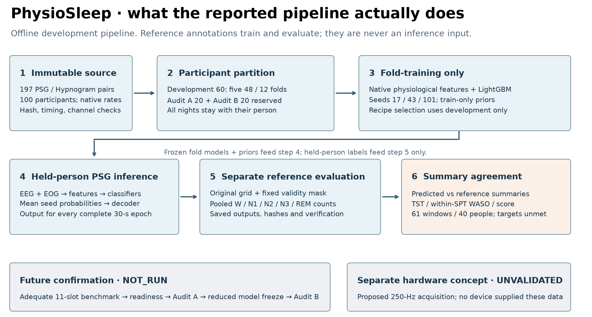
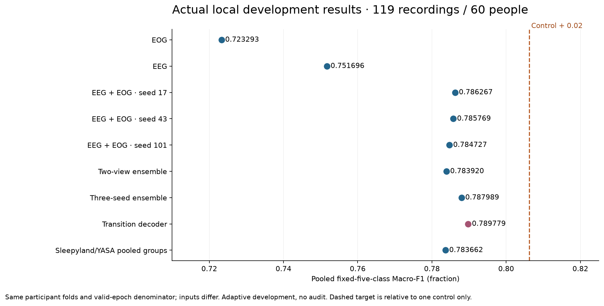
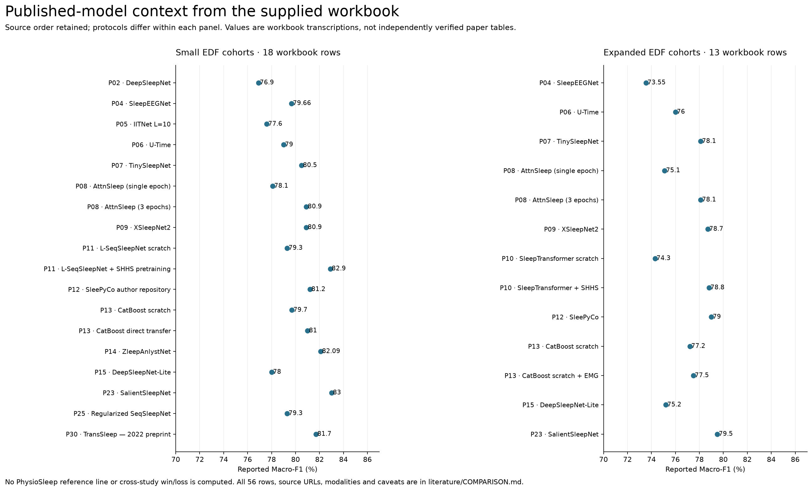
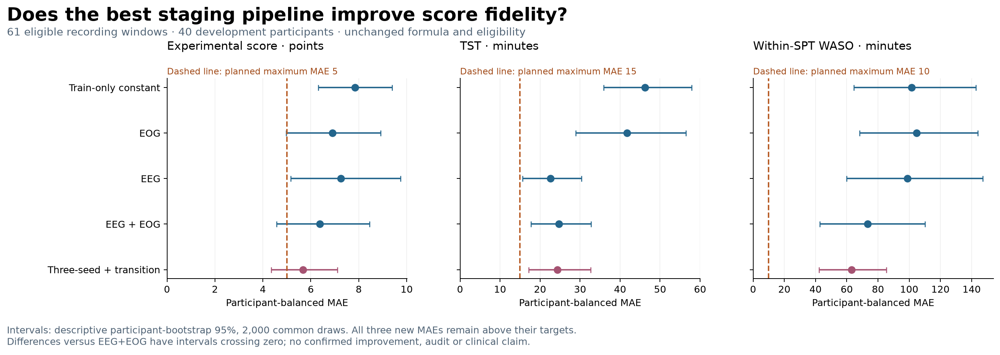

# PhysioSleep

**From EEG and eye movement signals to sleep stages, inspectable results and an experimental sleep summary.**

PhysioSleep is an offline sleep-research pipeline for specialist review. It checks Sleep-EDF recordings, predicts **Wake, N1, N2, N3 and REM** for each complete 30-second epoch, and evaluates every prediction on a fixed participant-disjoint protocol. The current strongest system combines native physiological features, locally trained LightGBM models, three-seed averaging and a train-only transition prior. A specialist HTML demonstration and hardware acquisition concept accompany the research.

**For judges: [read the final English report](docs/FINAL_REPORT.md) or [start the five-minute review](docs/JUDGE_GUIDE.md). For developers: [setup and source map](docs/DEVELOPER_GUIDE.md).**

[](https://github.com/ladekarl1234-commits/physiosleep/actions/workflows/verify.yml)

## Audit A and B: completed exploratory tests

| Test | Macro-F1 | Descriptive 95% interval | Accuracy | Participants / recordings |
|---|---:|---:|---:|---:|
| Audit A | **0.7590** | 0.7245 to 0.7873 | **88.76%** | 20 / 39 |
| Audit B | **0.7989** | 0.7816 to 0.8156 | **91.24%** | 20 / 39 |

Actual reference scoring of all 78 recordings is complete. The tested system is the existing **single seed-17 LightGBM control trained on D60 using YASA EEG+EOG features**. The development ensemble below is a different system. N1 remains the weakest stage (F1 0.469 / 0.499). These exploratory tests do not complete the all-baseline +0.02 gate; the original holdouts are consumed and fresh participants are required for confirmation.

[Final English report, formula and interpretation](docs/FINAL_REPORT.md) | [Audit class metrics and provenance](reports/exploratory-audits-v1/report.md) | [Replayable aggregate](reports/exploratory-audits-v1/aggregate.json)


| Measured development result | Research status | Latest simulated scientific reviews |
|---|---|---|
| **0.789779 Macro-F1**; **90.738% accuracy** | 119 recordings / 60 development participants | Sleep specialist **73 / 100** |
| **+0.003512** over the fixed EEG+EOG control | Required margin **+0.02** remains unmet | Data/ML **58 / 100** |
| Five participant-disjoint development folds | Audit A/B **EXPLORATORY_EVALUATED** | [Rubrics, dates and findings](docs/JUDGING.md) |

The review grades are simulated scientific assessments, not official competition approval. Documentation changes do not automatically increase them. The mandatory eleven-slot benchmark is incomplete; the owner has ended further baseline testing for this delivery. The original +0.02 gate remains NOT_RUN.

## What to open

| Your question | Read this |
|---|---|
| What was measured, and what does it prove? | [Final English report](docs/FINAL_REPORT.md), [judge guide](docs/JUDGE_GUIDE.md) and [documentation index](docs/README.md) |
| How do signals become stages, scores and evidence? | [Pipeline and architecture](docs/PIPELINE.md) |
| Which training jobs, tests and audits actually ran? | [Development / test job ledger](docs/EXPERIMENTS.md) |
| How do our models compare on the same people? | [Local results and ablations](docs/RESULTS.md) |
| What do the models in the supplied Excel report? | [56-row literature comparison](literature/COMPARISON.md), [31 papers](literature/PAPERS.md), [CSV](literature/experiments.csv) |
| Why these decisions? What is still missing? | [17 architecture decisions](docs/adr/README.md), [historical reviewer roadmap](docs/ROAD_TO_90.md) |

## Pipeline



The detailed [pipeline guide](docs/PIPELINE.md) maps each step to source modules, artifacts, assumptions and tests. Reference annotations never enter the prediction interface. Every night from a person stays in the same partition. The original A/B cohorts were evaluated exploratorily and are retired from confirmation.

## Actual local model comparison



The nine systems share development participants, folds and the reference-valid epoch denominator; their channel inputs differ. The best system exceeds the clean local Sleepyland/YASA route (**0.783662**) by **0.006117**. Neither this nor its **0.003512** gain over the fixed control meets +0.02. These are adaptive development comparisons. [Exact results, channel counts, failure cases and uncertainty](docs/RESULTS.md).

## Comparison with published models

The supplied Excel contains **31 papers and 56 experimental settings**, including DeepSleepNet, U-Time, TinySleepNet, AttnSleep, XSleepNet, SleepTransformer, SleePyCo, YASA and SLEEPYLAND. We publish the numeric rows, source URLs, sheet/row identifiers and caveats rather than reducing them to a list of names.



These are **workbook-reported literature values** with different cohorts, cropping, pretraining and aggregation. They are not a local leaderboard or verified superiority claims. Read [all 56 comparison rows](literature/COMPARISON.md) or download [experiments.csv](literature/experiments.csv) and [papers.csv](literature/papers.csv).

## Development, tests and evidence status

| Work | Evidence available | Final-delivery status |
|---|---|---|
| Local feature models, ensembles and transition decoder | Complete five-fold development outputs and aggregate replay | Development evidence only; best pipeline was not audit-tested |
| Sleepyland/YASA compatibility route | Clean five-fold fit; five-fold numerical parity; Macro-F1 0.783662 | Development evidence only; further route testing stopped by owner |
| AttnSleep | Safely checkpointed at **65/100 epochs**, fold 0; [job snapshot](docs/EXPERIMENTS.md) | Incomplete; no further fit requested |
| U-Time / U-Sleep | U-Time failed epoch preserved; U-Sleep preparation completed without a model fit | Incomplete; no further fit requested |
| Public software checks | **99 synthetic tests**, exact aggregate replay and publication checks in [hosted CI](https://github.com/ladekarl1234-commits/physiosleep/actions/workflows/verify.yml) | Software evidence, not model confirmation |
| Audit A / B | Completed exploratory tests: 39 recordings / 20 people each | Formal gates NOT_RUN; original holdouts consumed |

## Experimental score and hardware

The frozen staging candidate has **score MAE 5.68 points, TST MAE 24.33 minutes and within-SPT WASO MAE 63.09 minutes** on 61 eligible recording windows from 40 people. All three exceed the planned maxima of 5, 15 and 10. There is no clinical sleep-quality validation. [Score results and definitions](docs/RESULTS.md#experimental-score).



Hardware artifacts specify acquisition, timing, filtering and packet requirements and include synthetic fault checks. **No device has been built or validated.** Images are labeled concepts; physical bench and paired-reference tests remain required. [Hardware guide](docs/HARDWARE.md).


## Run the public checks

```bash
python -m pip install numpy==1.26.4 pyedflib==0.1.42 xlrd==2.0.2 PyYAML==6.0.3
python tools/verify_public_metrics.py
python tools/verify_exploratory_metrics.py
python -m unittest discover -s tests -v
python tools/check_publication.py
```

Run from a clone of this repository. These commands require no EDFs, GPU or private models. For figure rebuilding, environments, source ownership and the additional requirements for exact training, read the [developer guide](docs/DEVELOPER_GUIDE.md) and [reproduction guide](docs/REPRODUCIBILITY.md).

The public package contains source, synthetic tests and aggregate evidence. Original signals, participant-linked labels/predictions, private checkpoints, vendor weights, credentials and commercial font files remain excluded. [Rights and exclusions](RIGHTS.md) | [claim-to-evidence ledger](docs/CLAIMS.md) | [final report](docs/FINAL_REPORT.md).
