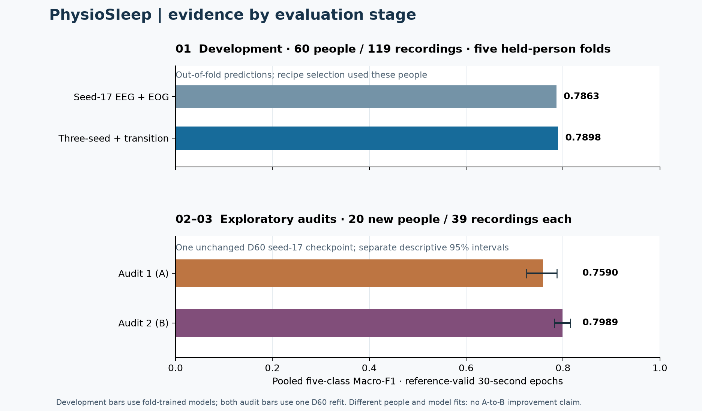
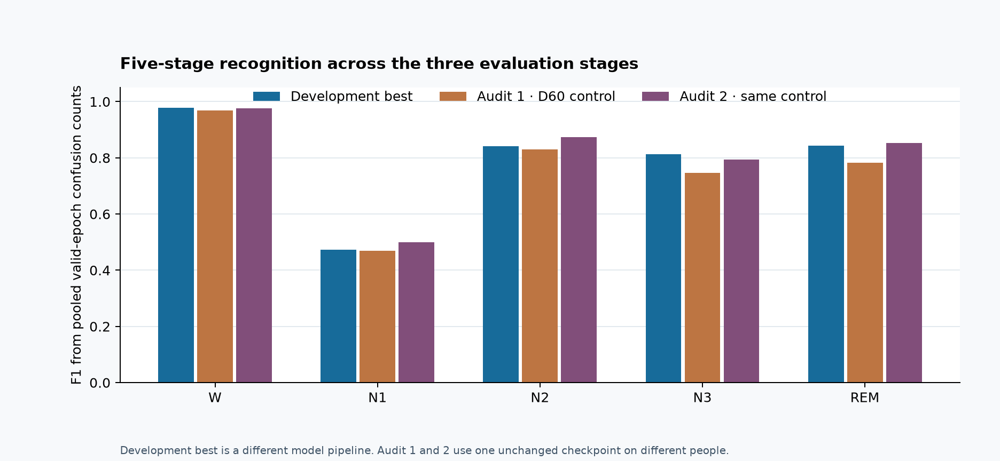

# Evaluation stages: development, Audit 1 and Audit 2

[Judge guide](JUDGE_GUIDE.md) · [Final report](FINAL_REPORT.md) · [Public aggregate replay](../tools/verify_exploratory_metrics.py)

This is the three-stage path a reviewer may call **dev/train → audit 1 → audit 2**. Audit 1 is the original **Audit A** cohort; Audit 2 is the original **Audit B** cohort. The picture deliberately separates development from the two audits because the development models were fitted within folds, while **one unchanged model refitted on all 60 development people** made both audit predictions. Audit 2 was not a retraining step or a second attempt after Audit 1.

| Stage | People / recordings | What made the predictions | Reference-valid epochs | Pooled Macro-F1 | Accuracy | N1 F1 | Evidence status |
|---|---:|---|---:|---:|---:|---:|---|
| Development, fixed seed-17 control | 60 / 119 | Five 48-fit / 12-held-person folds, EEG+EOG features | 274,271 | 0.786267 | 90.494% | — | Out-of-fold, used for selection |
| Development, selected pipeline | 60 / 119 | Three seed models plus train-only transition prior, same folds | 274,271 | **0.789779** | 90.738% | 0.4722 | Best completed development result; not audit-tested |
| Audit 1 (A) | 20 / 39 | Frozen D60 seed-17 EEG+EOG single model | 91,915 | **0.759022** | 88.757% | 0.4692 | Exploratory evaluated; cohort consumed |
| Audit 2 (B) | 20 / 39 | **Same** frozen D60 seed-17 model | 91,466 | **0.798875** | 91.239% | 0.4988 | Exploratory evaluated; cohort consumed |

The two audit intervals are **0.7245–0.7873** and **0.7816–0.8156**, respectively. They are separate, descriptive participant-bootstrap intervals, not a paired A-versus-B test. The people and recordings differ. Do not subtract the audit scores to claim the model improved. There is no matching audit score for the selected development ensemble.

The public comparison aggregate does not include the seed-17 control's per-class F1, so that cell is left blank rather than inferred from another model.

## What each stage establishes

1. **Development:** participant-disjoint out-of-fold predictions support selection and local ablations. All nights of one person stay in the same fold. The best pipeline exceeds its fixed seed-17 control by **0.003512 absolute Macro-F1**, below the proposed +0.02 margin. Because selection used development evidence, this is not independent confirmation.
2. **Audit 1:** the frozen single-model control predicted every complete 30-second epoch from PSG signals before reference labels were opened. The evaluator scored 91,915 reference-valid epochs; 721 invalid-reference epochs stayed in the original timeline. This is a measured exploratory held-person result.
3. **Audit 2:** the same checkpoint followed the same sequence for a disjoint set of 20 people. The evaluator scored 91,466 reference-valid epochs; 1,635 invalid-reference epochs stayed in the timeline. This is another exploratory held-person result, with no model update between audits.

The complete grids contain **276,133 development**, **92,636 Audit 1** and **93,101 Audit 2** 30-second epochs. Prediction coverage is complete for the two audits. A stage score includes only epochs valid under the original reference mask; a model cannot choose which epochs are excluded. [Confusion matrices](../reports/exploratory-audits-v1/confusion.png) and [audit class F1](../reports/exploratory-audits-v1/class-f1.png) show where errors occur.

## How the primary metric is computed

For each stage in the fixed order **W, N1, N2, N3, REM**, pool confusion counts over all reference-valid epochs **within that evaluation stage**. If `TP`, `FP` and `FN` are its counts, `F1 = 2TP / (2TP + FP + FN)`; a zero denominator contributes zero. **Macro-F1 is the arithmetic mean of the five stage F1 values.** This is neither accuracy nor an average of night or participant F1 scores. For Audit 1 N1, `TP=2,766`, reference N1 support `=6,250`, predicted N1 support `=5,541`, so `F1 = 2×2,766 / (6,250+5,541) = 0.4691714`. [Full formula and evaluation detail](FINAL_REPORT.md#how-macro-f1-is-calculated-and-why-it-is-primary).

Wake occupies about 63.4% of valid epochs in each audit. The high accuracy values therefore need the class-balanced Macro-F1 and N1 result beside them. For Audit 1 and Audit 2 the public [aggregate counts](../reports/exploratory-audits-v1/aggregate.json) replay the point scores; the [independent verification receipt](../evidence/exploratory-audits-verification.json) records a check against protected prediction/reference arrays. A public clone does not include those arrays or the participant counts needed to reproduce bootstrap intervals.

N1 is the weakest stage in all three displayed evaluations. The development series is the **selected three-seed pipeline**; the audit series belong to the **single D60 seed-17 model**. [Download the vector figure](../reports/evaluation-overview/class-stages.svg).

## Decision and figure provenance

Both original audit cohorts were **exploratorily evaluated and retired from confirmation**. The historical formal Gate A/B criteria require a matched +0.02 gain over all mandatory comparators and positive simultaneous participant intervals; they remain **NOT_RUN**. Baseline experiments were stopped for this delivery. New confirmation would require fresh people and a prospectively frozen protocol. [Comparator registry](BASELINES.md) · [Final decision](adr/0017-final-exploratory-delivery.md).

Both figures are rebuilt with [this public script](../tools/build_evaluation_overview.py) from [development model aggregates](../reports/judge-guide/local-comparison.json), [development confusion counts](../evidence/development-metrics.json) and the [sanitized audit aggregate](../reports/exploratory-audits-v1/aggregate.json). The overview uses one 0–1 axis, labels model identity in each panel and displays only the two available descriptive audit intervals. [SVG overview](../reports/evaluation-overview/stages.svg).
