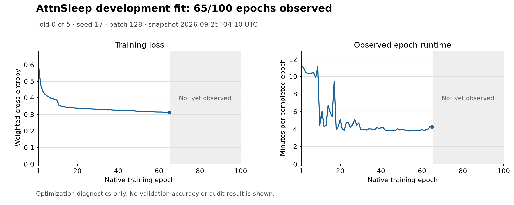

# Development jobs, software tests and audits

[Judge guide](JUDGE_GUIDE.md) · [Results](RESULTS.md) · [Mandatory registry](BASELINES.md)

**Snapshot: 25 September 2026, after exploratory A/B evaluation and U-Sleep signal preparation.** This is a dated observation, not a live job dashboard. The owner has since ended further U-Sleep, Sleepyland and other baseline testing for this delivery; unfinished rows below are preserved as evidence, **not an active queue**. A development fit, a software test and a confirmatory audit are different jobs. [Final decision](adr/0017-final-exploratory-delivery.md) | [Machine-readable snapshot](../evidence/job-status.json).

## Completed development work

| Job | Scope and recipe | Result | Evidence |
|---|---|---|---|
| EEG / EEG+EOG native-feature screen | Six channel/learning-rate configurations; development only | Selected 400-round, learning-rate 0.1 route; convergence unresolved | [Scientific report](REPORT.md#development-experiments-and-results) |
| Fixed EEG+EOG seeds 17 / 43 / 101 | Five participant-disjoint folds each; 119 held-person outputs | Macro-F1 0.786267 / 0.785769 / 0.784727 | [All local systems](RESULTS.md), [aggregate figure input](../reports/publication-figures/summary.json) |
| EOG-only and EEG-only routes | Same 60 people / 119 recordings | Macro-F1 0.723293 / 0.751696 | [Local comparison](RESULTS.md) |
| Two-view and three-seed averaging | Saved out-of-fold probabilities; no audit tuning | 0.783920 / 0.787989 Macro-F1 | [Aggregate input](../reports/judge-guide/local-comparison.json) |
| Three-seed transition decoder | Training-person priors; transition weight 0.1, duration weight 0 | 0.789779 Macro-F1; +0.003512 vs control | [Exact confusion replay](../evidence/development-metrics.json) |
| Sleepyland/YASA clean route | Five folds; seed17; 400 rounds; two feature groups / three distinct channels | 0.783662 Macro-F1; all five native parity checks pass | [Verified aggregate receipt](../evidence/sleepyland-yasa-development.json) |
| Frozen candidate score extension | Same 61 eligible windows / 40 people; unchanged formula and 2,000 draws | All three MAEs fail targets; paired bands versus EEG+EOG include zero | [Independent verification](../evidence/score-extension-verification.json) |

## Stopped and failed native training at the recorded snapshot

| Job | Observed status | Next completion requirement |
|---|---|---|
| AttnSleep seed17, fold0 | **STOPPED_WITH_VERIFIED_RESUMABLE_CHECKPOINT**, completed **65/100 epochs**; batch128, 1,702 updates/epoch | Complete serious native folds, seed evaluations and prediction verification. Training loss is not held-out F1. |
| U-Time fold0, inner seed17 | **FAILED** after 433 training updates and validation; final state commit rejected tuple/list JSON representation | Read-only actual restoration and all 119 prepared-record hashes verified. Pointer fix passed 27 tests. Fresh original-seed replacement selected; renew source-bound qualifications before fitting. Old failed run remains preserved. |
| Original U-Sleep preprocessing and engine | **119/119 development recordings prepared**, 276,133 complete signal epochs; fold-0 seed-17 inputs bound to 40 fit and eight inner-validation people across 95 recordings. Current-source numerical, batch-64 and 2,880-epoch inference preflights passed. [Aggregate execution receipt](../evidence/usleep-development-preparation.json) · [Independent saved-artifact check](../evidence/usleep-preparation-independent-verification.json) | No model fit. Integrated production-epoch qualification, complete folds and prediction verification remain. |
| Remaining mandatory native families/variants | Incomplete; some code rights, weights/lineage and runtime prerequisites unresolved | [Family-by-family registry](BASELINES.md) and [rights recheck](../evidence/rights-recheck-20260925.md) |

Observed protected-workspace commands were `python -B -m sleepedf.attnsleep_cuda run-development --seed 17` and `python -B -m sleepedf.tf_experiment epoch --root . --manifest runs/utime/fits/fold-0/seed-17/inner/manifest.json`, each under its separately pinned environment and resource supervisor. **They require private protocol/data/runtime artifacts absent from a plain public clone.** No command here authorizes bypassing a source hash or resuming the failed U-Time identity as if it succeeded.

[Epoch data](../reports/training-progress/attnsleep-epochs.csv) · [Snapshot provenance](../reports/training-progress/snapshot.json) · [Rebuild script](../tools/build_training_progress.py). This is one incomplete development fold. No held-out accuracy is inferred from decreasing training loss.

## Software and verification jobs

| Check | Observed result | What it proves / does not prove |
|---|---|---|
| Public unittest suite | **99 synthetic checks** in this revision (92 original plus seven exploratory checks); hosted CI records the exact tested revision | Synthetic data/timing/split/prediction/gate/decoder/summary behavior; not trained accuracy |
| Public metric replay | **PASS** for best candidate and Sleepyland/YASA | Exact aggregate confusion arithmetic; not independent raw-prediction access |
| Publication checks | **PASS** at recorded hosted revision | Tracked-file boundaries, links and bound source/figure hashes; not a formal privacy proof |
| Score extension review | **PASS**, 501 frozen bindings and 12 paired contrasts checked | Saved development evidence; no audit or clinical validation |
| Synthetic U-Time restart | **PASS**, three CPU-only fresh processes; 331 ordered state arrays compared, five tamper cases rejected | Batch-one test continuation; not actual batch12 research-checkpoint adoption |

See the [observed hosted-CI receipt](../evidence/hosted-ci.json), [workflow](../.github/workflows/verify.yml) and [reproduction commands](DEVELOPER_GUIDE.md). The receipt identifies its exact tested commit; newer documentation is not retroactively covered by an older run. The workflow page shows checks for each subsequent push.

## Exploratory evaluation and formal confirmation

| Job | People | Status | Interpretation |
|---|---:|---|---|
| Audit A | 20 | **EXPLORATORY_EVALUATED**, F1 **0.759022** | 39 recordings, frozen D60 single-model control; no mandatory-comparator gate pass |
| Audit B | 20 | **EXPLORATORY_EVALUATED**, F1 **0.798875** | 39 recordings, same control; not reduced-sensor confirmation |

The original formal gates require at least **0.02 absolute pooled Macro-F1 improvement over every mandatory comparator** and positive simultaneous participant-bootstrap intervals, plus integrity and independent artifact checks. B is never a retry pool for a failed A. A running training job, a passed software check, a published paper score or an agent grade cannot substitute for this result.
