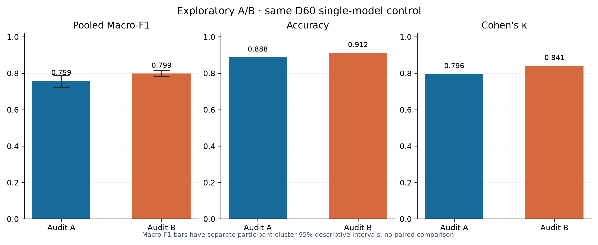
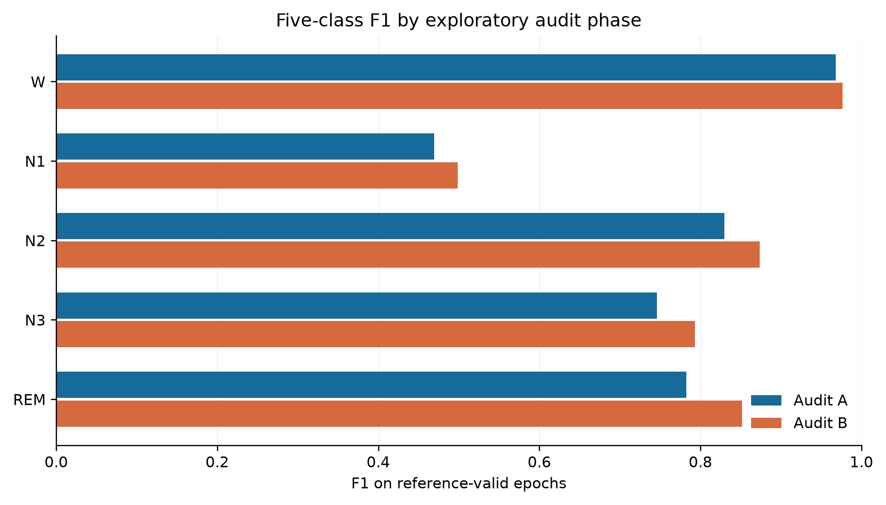
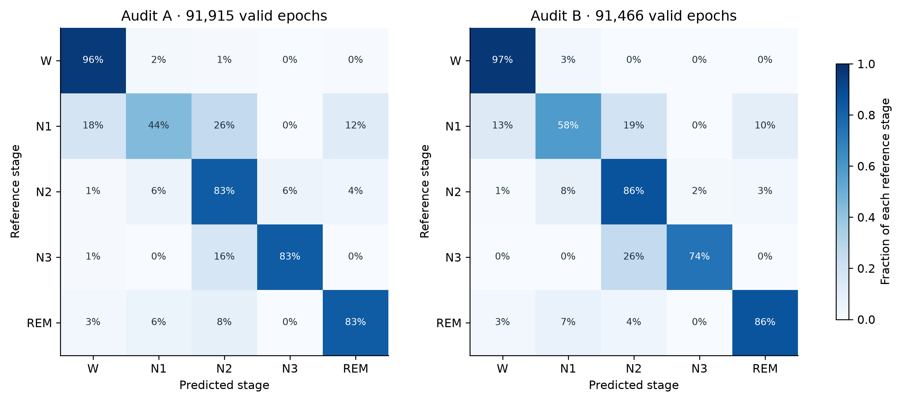

# PhysioSleep final research report

**Final delivery decision, 25 September 2026.** The owner ended further U-Sleep, Sleepyland and other mandatory-baseline experiments for this delivery. This report evaluates the results already obtained. The original eleven-comparator, +0.02 absolute Macro-F1 criterion remains a historical formal gate and **has not passed**. Audit A and B were both used for explicitly authorized exploratory testing; neither is an untouched confirmation cohort now.

[Start here for judges](JUDGE_GUIDE.md) | [Detailed scientific methods](REPORT.md) | [Audit evidence and commands](EXPLORATORY_AUDITS.md) | [Decision record](adr/0017-final-exploratory-delivery.md)

## Executive findings

PhysioSleep processes Sleep-EDF Expanded PSG signals into five 30-second sleep stages. Its evaluated audit checkpoint is a **locally trained, single seed-17 LightGBM model** using native YASA features from Fpz-Cz EEG and horizontal EOG. It was fitted on all 60 development participants. It is **not** YASA's released classifier and **not** the three-seed transition ensemble that scored 0.789779 on development out-of-fold predictions. The exact same frozen single model produced all Audit A and B predictions without reference labels in the inference interface.

| Measurement | Audit A | Audit B |
|---|---:|---:|
| Participants (SC / ST) | 20 (16 / 4) | 20 (16 / 4) |
| Recordings | 39 | 39 |
| Complete 30-second epochs | 92,636 | 93,101 |
| Reference-valid epochs scored | 91,915 | 91,466 |
| Invalid reference epochs retained in timeline | 721 | 1,635 |
| **Pooled five-class Macro-F1** | **0.7590217** | **0.7988747** |
| Separate descriptive 95% participant interval | 0.7245 to 0.7873 | 0.7816 to 0.8156 |
| Accuracy | 0.8876 | 0.9124 |
| Cohen's kappa | 0.7964 | 0.8413 |

These are measured held-person results on two disjoint groups within the same Sleep-EDF source. They are useful evidence of this checkpoint's performance on previously unused people in this dataset. They are **not** evidence that it exceeds all required algorithms, transfers to a different hospital or device, or improves from A to B: A and B contain different people, while the model is unchanged. Both audits had full prediction coverage for their complete epoch grids. The independent saved-array verification receipt and public aggregate replay support the stated metrics. [Report and provenance](../reports/exploratory-audits-v1/report.md) | [Verification receipt](../evidence/exploratory-audits-verification.json) | [Public aggregate](../reports/exploratory-audits-v1/aggregate.json).



## How Macro-F1 is calculated, and why it is primary

Use the fixed class order $K=[W,N1,N2,N3,REM]$. Let $C_{ij}$ count original, reference-valid 30-second epochs whose reference is class $i$ and prediction is class $j$. Pool these counts across every recording in one audit **before** calculating any class score. For class $k$, let $TP_k=C_{kk}$, $FN_k=\sum_j C_{kj}-C_{kk}$, and $FP_k=\sum_i C_{ik}-C_{kk}$. Then

$$
F_{1,k}=\frac{2TP_k}{2TP_k+FP_k+FN_k}
=\frac{2C_{kk}}{\sum_j C_{kj}+\sum_i C_{ik}},
\qquad
\mathrm{MacroF1}=\frac{1}{5}\sum_{k\in K} F_{1,k}.
$$

A class with zero denominator contributes zero by the frozen evaluator rule. F1 is the harmonic mean of precision and recall; Macro-F1 gives each **stage** equal weight and ranges from 0 to 1. Wake supplies about 63.4% of the valid epochs in each audit, so accuracy alone can look high while an uncommon stage is detected poorly. Here N1 F1 is below 0.50 in both audits. Macro-F1 exposes that weakness. The pooled metric still gives people with longer valid recordings more influence; it is **not** the mean of participant-level F1 values. We report participant-aware uncertainty separately.

For an inspectable example, Audit A has 2,766 correctly identified N1 epochs, 6,250 reference N1 epochs, and 5,541 predicted N1 epochs. Thus $F_{1,N1}=2(2766)/(6250+5541)=5532/11791=0.4691714$. The five class values below average to Audit A's 0.7590217. The point scores are computed from integer confusion counts using exact rational arithmetic before decimal display; the underlying [evaluation implementation](../sleepedf/evaluation.py) and [public replay](../tools/verify_exploratory_metrics.py) are inspectable.

| Stage F1 | Audit A | Audit B |
|---|---:|---:|
| Wake | 0.9680 | 0.9767 |
| N1 | **0.4692** | **0.4988** |
| N2 | 0.8298 | 0.8739 |
| N3 | 0.7458 | 0.7931 |
| REM | 0.7823 | 0.8519 |





## Evaluation design and independent checks

Participants, rather than epochs or nights, define the partitions: development has 60 people, and Audit A and B each have 20. Every night of a person stays in one partition. The source files and reference annotations were preserved. The inference interface takes signals and declared channels, with no Hypnogram argument; reference labels are joined later by the evaluator. It requires a prediction for every complete original PSG epoch and applies the same reason-coded reference-valid mask to all metrics. Unlabeled, recording-local robust normalization is part of the frozen offline inference route; audit participants do not fit shared cross-record preprocessing or model parameters.

The checkpoint, selection manifest and protocol were frozen before audit inference. Successful prediction receipts for all 78 recordings preceded reference-label access. A separate verifier checked saved prediction/reference grids, masks, hashes and calculations. Public replay recomputes the point metrics and figure hashes from sanitized aggregates; the protected per-epoch arrays and bootstrap inputs are intentionally not in GitHub.

Each displayed 95% interval uses 10,000 participant-bootstrap resamples, sampled separately within the 16 SC and four ST people in that audit while keeping each sampled person's nights together. A uses PCG64 seed 2026092301; B uses 2026092302. These **separate descriptive** intervals condition on the frozen checkpoint. They omit training and model-selection variability, are not simultaneous comparator intervals, and cannot repair the small four-person ST sample. The published [verification receipt](../evidence/exploratory-audits-verification.json) records independent private-array replay; a public clone can reproduce aggregate arithmetic but cannot independently rerun private inference.

## Comparison, limitations and decision

The strongest completed development pipeline scored pooled Macro-F1 **0.789779** on five participant-disjoint folds. Its gain over its fixed EEG+EOG control was **+0.003512**, below the original +0.02 target. A clean local Sleepyland/YASA development route scored **0.783662**. These are **development comparisons**, not scores on A or B; the stronger three-seed pipeline was not audit-tested. Published scores transcribed from the supplied [31-paper, 56-setting workbook](../literature/COMPARISON.md) use unmatched datasets and protocols. None supplies a missing same-audit comparator result. The formal eleven-slot comparison and its simultaneous paired intervals remain **NOT_RUN**; the owner has ended further baseline testing for this delivery. A future claim of the original +0.02 requirement would need permitted, adequate comparators and **fresh** confirmation people under a prospectively frozen protocol. [Historical registry](BASELINES.md) | [Detailed local comparisons](RESULTS.md).

The main observed classification weakness is N1. Results are from Sleep-EDF cohorts rather than an external clinical site. The earlier experimental duration/continuity score failed its planned error targets and lacks independently established whole-night boundaries. Its [worked synthetic sensitivity cases](REPORT.md#provisional-score-and-sensors-adverse-results) show that changing one boundary epoch can lower Q while TST rises, and that replacing N1 with REM at fixed TST/SPT leaves Q unchanged. The specialist HTML is a review demonstration, and hardware images are acquisition concepts: neither a clinical product nor a measured device. These limitations prevent a clinical sleep-quality, minimum-sensor, hardware-performance or competition-winning claim. [Score and sensor evidence](RESULTS.md#experimental-score) | [Hardware evidence](HARDWARE.md) | [Claim ledger](CLAIMS.md).

The simulated review grades on the fixed rubrics are **75/100 from the sleep-specialist perspective** and **61/100 from the data/ML perspective**. The specialist gained one point for independently reviewed, test-linked score sensitivity examples and another for a publicly replayable [generated hardware evidence bundle](../evidence/hardware-desk-replay.json); data/ML gained points for a [complete publisher-byte crosswalk](../evidence/publisher-content-crosswalk-20260925.json), a separately reviewed [197-pair annotation/grid crosscheck](../evidence/reader-annotation-crosscheck-20260925.json) and an existing-candidate [lineage review](../evidence/judging/ml-candidate-lineage-regrade.json). Full immutable hash ancestry did not earn the remaining point. These grades describe evidence quality, not classification accuracy or official judging. Better wording does not create missing experimental evidence; [review findings](JUDGING.md) remain open where physical validation, comparators or external confirmation are required.

## Questions a judge can answer from this release

| Question | Evidence-based answer |
|---|---|
| Did this model predict actual held-out annotations? | Yes. Both exploratory audits were scored after signal-only prediction freezes; 39 recordings and 20 people per phase. |
| Why use Macro-F1 instead of accuracy? | Each stage contributes one fifth, exposing N1 F1 below 0.50 despite 88.76% / 91.24% accuracy and a Wake-heavy denominator. |
| Is B a successful second trial after A? | No. One unchanged checkpoint was evaluated on two distinct participant sets. B was not a model-selection retry and is now consumed. |
| Is the +0.02 superiority target met? | No. Mandatory same-audit baseline predictions and simultaneous paired intervals are missing. Literature numbers and development gains do not fill that gap. |
| Can a public reader check the numbers? | Yes for aggregate arithmetic, figures and synthetic contracts. Private EDFs, predictions and checkpoints are deliberately excluded. |
| Does the hardware or score have clinical validation? | No. The score missed planned error limits, and the hardware has no physical bench or paired-reference evidence. |

For a public, data-free check from the repository root:

```bash
python tools/verify_exploratory_metrics.py
python tools/verify_public_metrics.py
python -m unittest discover -s tests -v
python tools/check_publication.py
```

These verify published arithmetic and software contracts, **not** a new model fit or clinical performance. The [developer guide](DEVELOPER_GUIDE.md) explains dependencies and source structure. [ADR 0017](adr/0017-final-exploratory-delivery.md) records why this is the final evidence scope.
