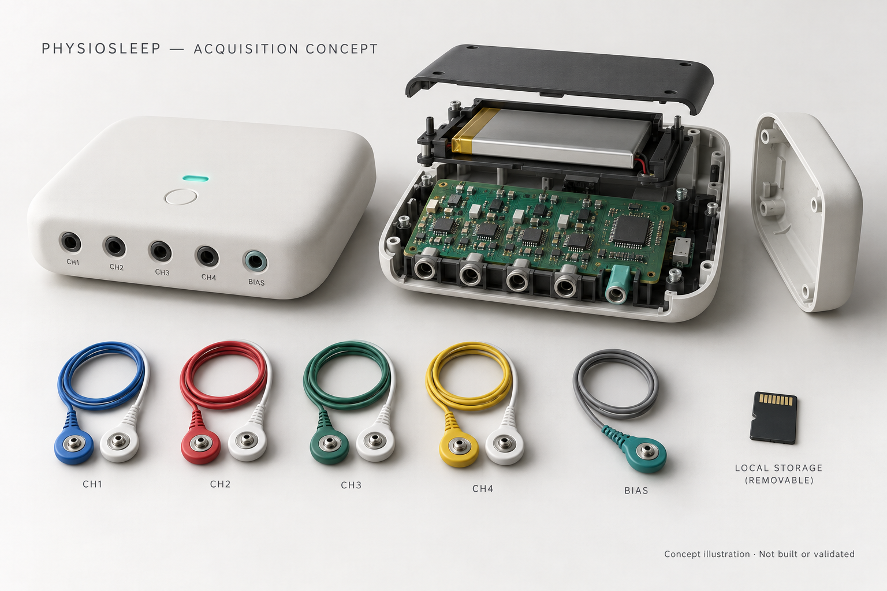
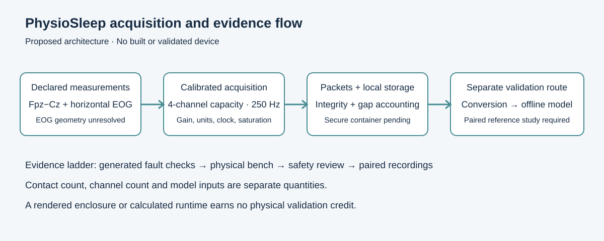
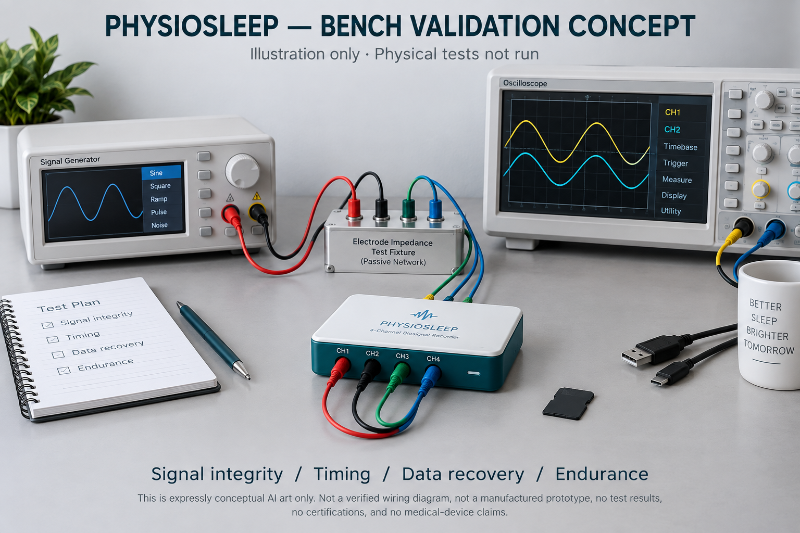

# Acquisition hardware: concept and verification plan

This is an AI-generated industrial-design illustration, not a photograph, manufactured board or qualified electrical layout. The generic PCB is not a wiring guide. No human-connected prototype or clinical use is represented.

## Measurement contract

The desk concept has four ADC channels of capacity, with provisional Fpz−Cz EEG and horizontal EOG requirements. An ADS1299-4 / nRF52840 concept supports local storage planning; part availability and physical performance require procurement-time checks. Fpz−Cz requires the Cz contact; a forehead-only band cannot be substituted. Horizontal EOG electrode geometry and polarity remain unresolved. Two separate bipolar measurements conditionally imply four sensing contacts plus bias. Shared references may change the contact count and must be validated explicitly.

Native acquisition is proposed at 250 Hz; a derived 100 Hz model route needs an explicit calibrated conversion contract and validation. The Sleep-EDF SC 1 Hz EMG envelope is not equivalent to raw EMG. Current models are not validated on this device or montage.

## Calculated budgets

| Quantity | Assumption / calculation | Status |
|---|---|---|
| Stream rate | 4,250 bytes/s under the proposed packet contract | Calculated |
| 12-hour storage | 183.6 MB decimal before overhead allowance | Calculated |
| 24-hour storage | 477.36 MB including 30% allowance | Calculated |
| Storage capacity | At least 1 GiB proposed | Requirement |
| Usable energy | 1 Ah × 3.7 V × 70% = 2.59 Wh | Assumption |
| Runtime | 2.59 Wh / 0.2 W = 12.95 hours | Calculated, not measured |

The delivered software qualification covers 15 filter, 21 clock and 21 packet test groups plus six generated integration cases. A 62-second fixture whose counter ends at 12 hours does not establish a 12-hour continuous recording. Persistent nonce management, secure capture-container implementation and physical B01–B10 bench work remain unqualified or NOT_RUN.

The [public generated-case receipt](../evidence/hardware-desk-replay.json) binds historical result and independent-review hashes. With Python 3.11, NumPy 1.26.4, SciPy 1.13.1 and Node 24.16.0/OpenSSL 3.5.6, run `python -B -m tools.verify_hardware_desk` from the repository root. It regenerates all six packet-to-clock cases in a disposable directory and checks fixture identities, valid-sample counts, epoch masks, transport failures and waveform error. The separate 15/21/21 filter, clock and packet test groups remain identified by historical private receipts; this public command does not rerun them.

## Required physical evidence

Acquire a specified board revision and calibrated signal source; measure input noise, gain/units, saturation, bandwidth/aliasing, common-mode behavior, contact/artifact response, sample-clock drift and loss recovery. Record real battery/storage endurance. Verify packet integrity, monotonic epoch alignment, interrupted-write recovery and offline export. Human-connected testing requires a separate safety and study authorization process.

Then collect synchronized paired device/reference measurements under a preregistered montage and participant protocol. Compare signal properties first, and staging/component errors on untouched people next. Calibration or model adaptation uses training participants only. Synthetic engineering checks, a similar chip and attractive enclosure art cannot replace this transfer study.

