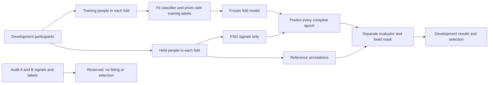

# Scientific pipeline and source architecture

[Judge guide](JUDGE_GUIDE.md) · [Developer guide](DEVELOPER_GUIDE.md) · [Results](RESULTS.md)

## Inputs, stages and artifacts

| Step | What happens | Code to inspect | Output / invariant |
|---|---|---|---|
| Source intake | Check identities, participant/night pairing, physical units, channel roles and annotation timing | [audit.py](../sleepedf/audit.py), [readers.py](../sleepedf/readers.py), [timing.py](../sleepedf/timing.py) | Original EDFs remain immutable; Marker/scorer/participant fields are never predictors |
| Participant allocation | Fix development 60, A 20 and B 20 before fitting; all nights stay together | [splits.py](../sleepedf/splits.py), [protocol.py](../sleepedf/protocol.py) | Five development folds: 48 fit / 12 held-out people |
| Epoch projection | Place half-open 30-second epochs on the original PSG timeline; retain gaps and invalid labels | [dataset.py](../sleepedf/dataset.py), [contracts.py](../sleepedf/contracts.py) | 276,133 complete development epochs; validity is separate |
| Native features | Verified Fpz−Cz EEG and horizontal EOG; native recording-local scaling and centered context | [yasa_baseline.py](../sleepedf/yasa_baseline.py) | Signal-only features; offline whole-record processing |
| Fold-local fitting | Locally train LightGBM with training labels; seeds 17/43/101, 400 rounds, learning rate 0.1 | [yasa_baseline.py](../sleepedf/yasa_baseline.py) | Source/config/checkpoint ancestry; no released pretrained YASA weights |
| Ensemble | Average the three complete five-class probability arrays equally | [development_ensemble.py](../sleepedf/development_ensemble.py) | Same held-person grid and class order for every member |
| Temporal decoding | Transition prior fitted on training people only; retain original probabilities as emissions | [temporal.py](../sleepedf/temporal.py), [temporal_experiment.py](../sleepedf/temporal_experiment.py) | Hard stages change; emissions are not decoded posterior probabilities |
| Common evaluation | Join saved predictions to evaluator truth by identity; one reference-valid mask | [predictions.py](../sleepedf/predictions.py), [evaluation.py](../sleepedf/evaluation.py) | 274,271 valid epochs; fixed-five-class F1 and confusion counts |
| Experimental summaries | TST, SPT, within-SPT WASO and frozen duration/continuity score | [sleep_summary.py](../sleepedf/sleep_summary.py), [provisional_score_study.py](../sleepedf/provisional_score_study.py) | Separate 61-window/40-person eligibility; failures visible |
| Confirmation gates | Adequate clean comparators, complete identical grids, exact margins and participant intervals | [gates.py](../sleepedf/gates.py), [audit_access.py](../sleepedf/audit_access.py), [precision.py](../sleepedf/precision.py) | No hand-written PASSED file can authorize a phase |

## Where reference labels are allowed

Development out-of-fold predictions exclude the evaluated person from that fold's fitting. They still support adaptive recipe selection, so they are not final confirmation. Audit data stay outside fitting shared normalization parameters, self-supervision, teachers, pseudolabels, calibration and model selection. Native signal-only recording-local scaling is an explicitly declared inference transform, not a population fit. The shared host provides procedural, not externally administered, separation.

## Model families and integration boundaries

The strongest route currently uses existing native physiological features and boosted trees. The mandatory neural families use separate pinned environments and subprocess adapters: AttnSleep, MSA-CNN, XSleepNet, TinySleepNet, U-Time/U-Sleep and packaged Sleepyland variants. Their native inputs, context and rates differ; the [registry](BASELINES.md) describes the contracts and gaps. A functioning adapter is not a completed baseline.

Sleepyland/YASA pools **two feature groups across three distinct physiological channels**: Fpz−Cz EEG + EOG and Pz−Oz EEG + the same EOG. Its five-fold fit is complete, but unchanged Docker-route equivalence and mandatory-slot adequacy remain incomplete.

## Runtime and failure handling

One heavy local model job runs at a time, with bounded CPU/RAM/disk leases and resumable optimizer/RNG checkpoints. Independent low-resource checks run within declared bounds. Records preserve commands, hashes, failed attempts and immutable parents. U-Time's failed state commit remains FAILED; candidate recovery cannot rewrite it into a historical success. See the dated [job ledger](EXPERIMENTS.md).

## Boundaries to later products

The specialist HTML is a demonstration, not clinical usability evidence. The score measures agreement with a formula on reference stages, not health or restorative sleep. Proposed 250-Hz hardware is a separate acquisition concept: the reported EEG/EOG data are native 100-Hz Sleep-EDF recordings, and no physical prototype produced them. See [hardware requirements](HARDWARE.md).
