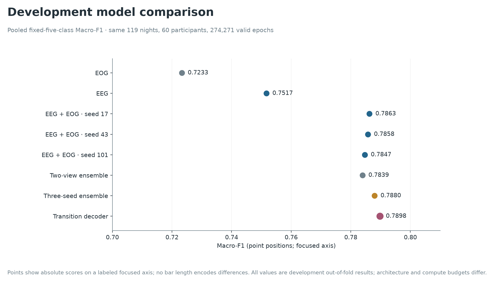
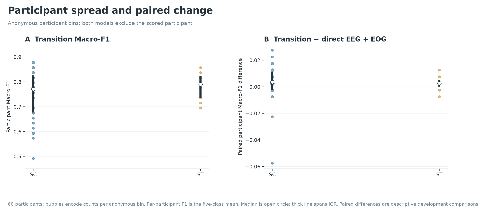
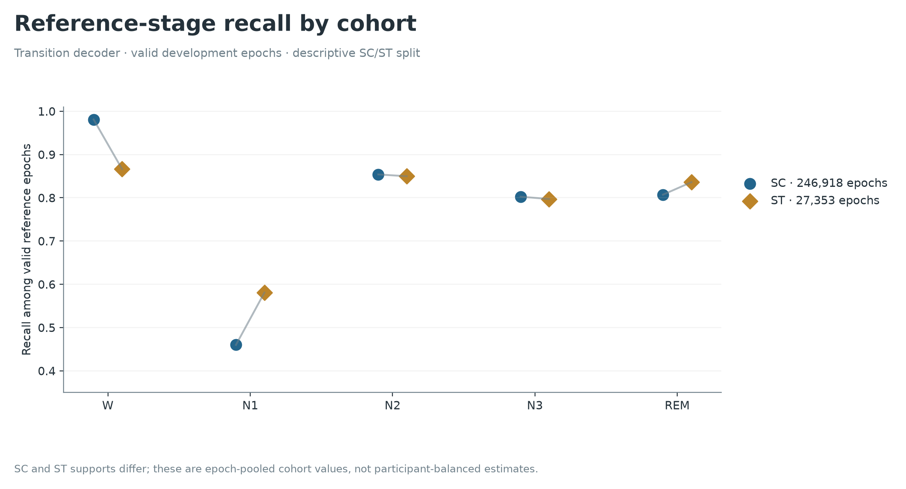
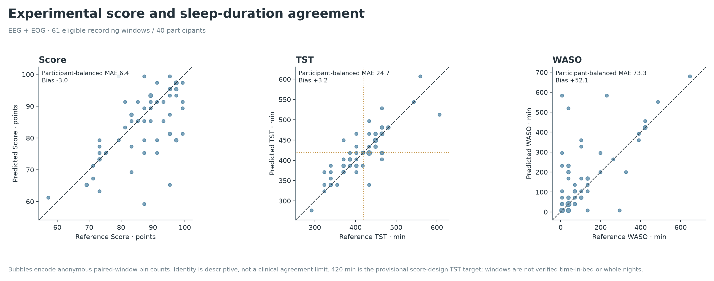
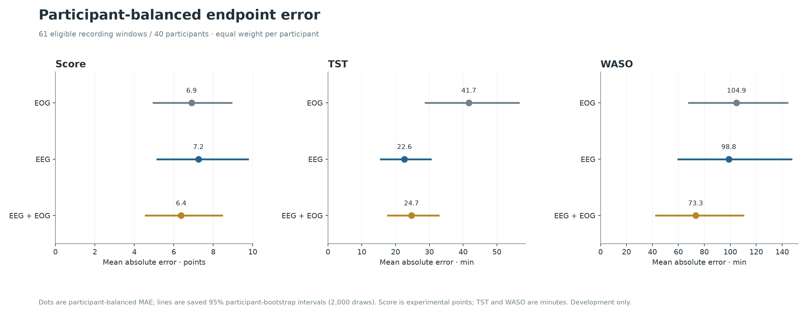

# PhysioSleep scientific report

This technical report records the full research program and its historical formal criteria. The [final delivery report](FINAL_REPORT.md) is the current summary. At the owner's 25 September 2026 direction, further mandatory-baseline experiments stopped; the original +0.02 gate remains NOT_RUN. Both A/B exploratory tests are complete for the D60 single-model control.

[Judge route](JUDGE_GUIDE.md) | [Pipeline](PIPELINE.md) | [Development/test jobs](EXPERIMENTS.md) | [Results index](RESULTS.md) | [Excel comparison](../literature/COMPARISON.md)

## Abstract and current decision

PhysioSleep investigates participant-disjoint five-class staging, interpretable recording-window summaries and the requirements for a later acquisition device. On the original 60-person development set, the best completed system uses native YASA physiological features, locally fitted LightGBM classifiers, a three-seed probability ensemble and a train-only transition prior. Pooled Macro-F1 is **0.7897786854**, accuracy **0.9073799272**, and Cohen's kappa **0.8322544088**. The gain over the fixed seed-17 EEG+EOG control is **0.0035116988**, not the required 0.02. No mandatory multi-family superiority or independent confirmation is established.

Both original audit cohorts have now been evaluated exploratorily following the owner's explicit 25 September authorization. The D60 seed-17 EEG+EOG single-model control achieved Macro-F1 **0.759022 on A** and **0.798875 on B**, with accuracy **88.76% / 91.24%**. See the [complete audit report](../reports/exploratory-audits-v1/report.md) and [evaluation guide](EXPLORATORY_AUDITS.md). These results are distinct from the development ensemble above and do not pass the mandatory-comparator gates. Both cohorts are consumed; future confirmation requires fresh people. Earlier provisional specialist and hardware work was authorized as a scope exception, without changing the benchmark criteria. This report supersedes historical deadline prose as a status description; retained evidence hashes preserve those earlier snapshots.

## Data and preprocessing

Sleep-EDF Expanded 1.0.0 contains 197 local recording pairs from 100 participants: SC 153/78 and ST 44/22. Source provenance is tied to the publisher's SHA-256 manifest. The completed data-readiness receipt covers the 394 paired EDF files; the earlier inventory also checked the 398 manifest entries. These are distinct recorded checks. Originals, source headers and annotations are never rewritten. See [PhysioNet acquisition description](https://physionet.org/content/sleep-edfx/1.0.0/).

EEG and EOG are natively 100 Hz. SC EMG is a processed 1 Hz envelope; ST EMG is 100 Hz. These measurements are not interchangeable. Local ST Marker channels are 10 Hz and excluded from predictive inputs. Physiological channels are selected by verified name and role. Participant IDs, scorer identity and markers are not model features.

Seven ST Hypnogram header compatibility cases were resolved through provenance-preserving reader handling; original bytes remain unchanged. Timing exceptions remain explicit: SC4362 has two annotation intervals outside PSG coverage; ST7011 has 3,140 seconds without annotation coverage and a 20-second trailing fragment. LightsOff exists in source metadata; LightsOn does not. None of these facts licenses guessing a whole-night window.

Epochs are fixed half-open 30-second intervals on the PSG timeline. Movement, Unknown, gaps and invalid annotations retain their positions. R&K stages 3 and 4 map to N3; this label mapping is not AASM rescoring. The fixed order is W, N1, N2, N3, REM. The 119 development recordings contain **276,133 complete epochs**, of which **274,271 are reference-valid** and **1,862 invalid**. Every complete epoch receives an output; the evaluator alone applies the common valid mask.

## Participants, fitting and estimands

Development contains 46 SC and 14 ST people; A and B each contain 16 SC and four ST people. Five fixed development folds each hold out 12 participants and fit on 48. Every night, window and derived feature follows its participant. SC:36 and ST:01 were assigned to development because their annotations had already been inspected. Cohort/age blocking and seeded hashing fixed the allocation. Audit people cannot fit shared cross-record preprocessing or model parameters, self-supervision, pretraining, teacher fitting, calibration or selection. The frozen offline inference route does apply unlabeled, recording-local robust normalization to each audit recording.

These are procedural holdouts on a shared account, not externally administered independent custody. Twenty participants per audit, including only four ST participants, limit precision and subgroup interpretation. Neither 10,000 bootstrap draws nor many epochs increases the number of independent people.

The headline estimand pools confusion counts over reference-valid epochs before calculating the mean of five class F1 scores; absent-denominator classes contribute zero. For stage k, F1 is `2TP_k / (2TP_k + FP_k + FN_k)`, and Macro-F1 is the unweighted mean over W, N1, N2, N3 and REM. It exposes weak classes that accuracy can obscure when Wake dominates; the [final report](FINAL_REPORT.md#how-macro-f1-is-calculated-and-why-it-is-primary) gives the full English derivation and an actual N1 example. Participant-average F1 is a separate estimand. Exact rational confusion arithmetic is used for the point-margin comparison. Whole-record normalization and centered context make the evaluated route **offline**, not causal online inference.

## Development experiments and results

The six-configuration screen varied EEG versus EEG+EOG and learning-rate multipliers 0.3, 1 and 3. It selected EEG+EOG, learning rate 0.1 and 400 boosting rounds. All classifiers were locally trained; released YASA weights were not used. Fixed seeds 17, 43 and 101 were run. Selection used development evidence; cross-validation results therefore remain conditional on adaptive recipe selection.

| System | Pooled Macro-F1 | Absolute change from fixed EEG+EOG seed-17 control |
|---|---:|---:|
| EOG feature model | 0.723293 | -0.062974 |
| EEG feature model | 0.751696 | -0.034571 |
| EEG+EOG, seed 17 | 0.786267 | 0 |
| EEG+EOG, seed 43 | 0.785769 | -0.000498 |
| EEG+EOG, seed 101 | 0.784727 | -0.001540 |
| Equal EEG / EEG+EOG probability mean | 0.783920 | -0.002347 |
| Three-seed EEG+EOG probability mean | 0.787989 | +0.001722 |
| Three-seed ensemble + transition prior | **0.789779** | **+0.003512** |

The best result's participant-average Macro-F1 is 0.756066, distinct from pooled 0.789779. Its class F1 values are W 0.97855, N1 0.47219, N2 0.84141, N3 0.81255 and REM 0.84420. N1 remains the weakest class. Wake constitutes 173,537 / 274,271 = 63.27% of valid epochs; high accuracy alone is insufficient.

The transition prior is fitted only on each fold's training people. It improves its undecoded ensemble parent by 0.001789. In Figure 01D, stage-fraction error uses all reference-valid recording epochs as the denominator, not sleep-only epochs. Its saved probabilities are original emissions, **not posterior probabilities of the decoded path**. Confidence plots label this distinction. The separate all-development refit checkpoint is the single seed-17 control; its participant-disjoint exploratory A/B results are now available in the [audit report](../reports/exploratory-audits-v1/report.md), with accuracy 88.757% and 91.239%. This is same-dataset generalization evidence, not external clinical validation. A 2,266-epoch signal-only demonstration on a training recording proves functional inference, not accuracy.

Round-prefix sensitivity increased from 0.782354 at 100 rounds to 0.786267 at 400; the best prefix sits at the endpoint, so convergence remains unresolved. Two-view averaging worsened the fixed control. Historical duration-only and combined-prior experiments did not replace the selected system. Missing ablations, longer training and other native families remain work, not successful experiments.

## Newly completed Sleepyland/YASA development route

The repaired native-classifier route completed all five clean development folds on 119 recordings / 60 people, using pooled Fpz-Cz+EOG and Pz-Oz+EOG feature groups. Seed 17, 400 boosting rounds and learning rate 0.1 produce Macro-F1 **0.7836621841**, accuracy **0.9046052991** and kappa **0.8272591097**. Independent saved-artifact checks reproduced all 119 output/reference grids, all five-fold native float32 parity arrays, checkpoint/source hashes, participant ancestry and confusion metrics. Runtime was 1,655.5 seconds with peak combined RSS 2.20 GB.

This resolves the previous stage-alias truncation failure through a copied object-dtype class-label facade; original saved model bytes and predictions are unchanged by that compatibility repair. This is a new clean development fit, not unchanged-container equivalence, released-weight reproduction or completion of the full mandatory slot. The best existing development candidate exceeds this route by 0.0061165, still below 0.02. [Public aggregate receipt](../evidence/sleepyland-yasa-development.json). The seven-figure set documents the earlier frozen development comparisons; this later result is reported separately.

## Descriptive uncertainty

Ten thousand common paired participant resamples preserve SC46/ST14 and all nights. PCG64 seed 2026092403, linear percentiles and Bonferroni tails 0.00625/0.99375 cover four prespecified contrasts. The three-seed-minus-control band is [+0.000364,+0.003084], transition-minus-control [+0.001620,+0.005431], transition-minus-parent [+0.000431,+0.003101], and two-view-minus-control [-0.006649,+0.001564].

These are approximate descriptive bands conditional on frozen development predictions. They do not account fully for adaptive selection, repeated fitting or overlapping fold training sets. They are neither audit confirmation nor a post-selection coverage guarantee. No readiness or superiority declaration follows from them.

## Historical mandatory benchmark and audit protocol

The following frozen criteria remain unchanged as a historical formal standard. They are **not an active experiment queue for this final delivery**: the owner ended further baseline testing on 25 September 2026. The owner-authorized exploratory tests did not meet this launch/readiness contract and do not constitute either formal gate. The original cohorts are retired; any future confirmation would use fresh participants under a prospective protocol.

Under the original formal contract, all eleven slots were mandatory; the [registry](BASELINES.md) distinguishes implementations from completed executions. Unknown released-weight training overlap or rights produces descriptive-only evidence. An executed duplicate requires both routes and verified equality. Omission, family resemblance, published scores or a two-epoch toy fit cannot complete a slot.

Under the original unexecuted confirmation design, Audit A would have required adequate native routes, complete clean predictions, frozen selected checkpoints, seed robustness and a development planning simulation meeting the 80% target. Development gain and baseline completeness did not satisfy readiness when the owner authorized exploratory use instead. Do not redraw A/B or use B to retry a failed A.

For each distinct frozen comparator b, require delta(b) = pooled F1(candidate) - pooled F1(b) >= **1/50**. A value of 0.0199 fails; values above 0.04 pass. Use 10,000 paired participant draws stratified by cohort, all nights retained, q=0.05/(2m), linear percentile intervals, and fixed PCG64 seeds 2026092301 (A), 2026092302 (B). Every lower bound must exceed zero. Report exact point-margin pass, positive-superiority support, and lower-bound >=0.02 support separately. Positive superiority does not establish that the true margin is at least 0.02.

Integrity requires identical participant/record/epoch/mask identities, all mandatory executions, clean fitted ancestry, frozen choices and independent artifact recomputation. Hand-written status files cannot authorize downstream commands. A failed A stays failed. Under the original design, B was reserved for a genuinely frozen reduced model after A passed; its teacher's A result could not certify it. The consumed original B cannot fulfill that future confirmation role.

## Provisional score and sensors: adverse results

The exploratory formula is Q=100*sqrt(min(TST/420 minutes,1)*TST/SPT). It combines duration adequacy and within-sleep-period continuity. It is insensitive to redistribution among sleep stages when TST/SPT remain fixed. It cannot demonstrate restorative sleep, normal architecture, subjective sleep quality or absence of disease.

TST is valid sleep minutes. SPT extends from the first sleep epoch start through the final sleep epoch end. WASO counts Wake only within SPT, excluding terminal Wake. The frozen score domain requires a declared observation window of at least seven hours, complete coverage and some sleep. All-Wake TST is zero, but continuity and Q are unavailable.

Score agreement uses the same formula on predicted and reference stages, with participant-balanced weighting among **61 eligible recordings / 40 people**, drawn from 119 / 60. Fifty-eight recordings were ineligible. No recording had independently established complete nightly boundaries. This is conditional recording-window arithmetic, not validated whole-night SQI. Missing LightsOn leaves TIB-dependent SE unavailable; SOL needs an independent attempt-to-sleep anchor. Missing intervals remain in coverage denominators.

| Model | Score MAE, points | TST MAE, minutes | Within-SPT WASO MAE, minutes |
|---|---:|---:|---:|
| EOG | 6.90 | 41.69 | 104.86 |
| EEG | 7.25 | 22.65 | 98.85 |
| EEG+EOG | 6.37 | 24.71 | 73.31 |
| Train-only constant | 7.84 | 46.23 | 101.61 |
| Planned maximum | **5** | **15** | **10** |

EEG+EOG descriptive 95% participant-bootstrap intervals are score MAE [4.58,8.45], TST MAE [17.74,32.76] and WASO MAE [42.72,110.13], using 2,000 cohort-stratified participant draws with participant-balanced errors. Score bias is -3.02 points and score P90 absolute error 16.56 points; these also miss their proposed B thresholds. EEG+EOG WASO P90 absolute error is 229 minutes. The 18-configuration sensitivity study preserved the frozen 420-minute/equal-weight geometric formula. Lower arithmetic-composition MAE is a sensitivity result, not selection or clinical validation.

 All tested channel configurations fail the joint targets. Three separately trained models do not constitute the full sensor-subset study, nor proof of a minimum channel set. The future B charter also requires score absolute bias <=3, score P90 <=10, and SE MAE <=5 percentage points where TIB is independently valid.

## Frozen candidate score extension

The already-frozen three-seed transition pipeline was scored on the **same 61 eligible windows / 40 development participants**, with the original formula, eligibility and four controls unchanged. No further fitting or window selection occurred. Independent verification replayed all 119 staging grids, the 61 eligible summaries, 501 frozen input hashes, 45 error intervals and 12 paired contrasts. [Verification receipt](../evidence/score-extension-verification.json); [aggregate values](../reports/score-extension/summary.json).

| Endpoint | Candidate MAE [descriptive 95% CI] | Candidate minus EEG+EOG MAE [paired 95% CI] | Planned maximum |
|---|---:|---:|---:|
| Score, points | 5.677 [4.353, 7.113] | -0.697 [-2.616, 1.198] | 5 |
| TST, minutes | 24.331 [17.112, 32.663] | -0.375 [-1.612, 0.900] | 15 |
| Within-SPT WASO, minutes | 63.088 [42.318, 85.433] | -10.225 [-45.182, 21.436] | 10 |

All three MAEs fail their targets. Each paired interval versus EEG+EOG includes zero. Score bias is +0.716 points; score P90 absolute error is 12.475 points, exceeding the ten-point target. TST and WASO P90 errors are 69 and 219 minutes. The same cohort-stratified participant resamples were used for all systems: 2,000 PCG64 draws, seed 2026092405. Each participant's eligible nights share equal total weight. These pointwise intervals are conditional, descriptive development estimates after adaptive staging selection; they are not simultaneous confirmation intervals or clinical evidence.

The earlier four-model figures remain intact as the historical analysis. This extension changes neither the score charter nor the minimum-sensor conclusion. The model with the best staging result does not establish adequate score fidelity. Missing independent nightly boundaries and TIB still prevent whole-night/SE claims. Original A/B have since been consumed for exploratory staging evaluation; they are retired from confirmation.

## Products, hardware and limitations

The specialist HTML is a local review demonstration with synthetic example epochs and editing/undo/export. It does not itself establish real inference or clinical usability. Consumer work was removed from scope. Owner-supplied fonts and private application state are excluded from this repository.

Hardware work establishes inspectable acquisition, filtering, clock and packet contracts and generated fault cases. It establishes no manufactured board, measured noise, 12-hour recording, safety compliance or paired-device performance. The [hardware section](HARDWARE.md) documents unresolved EOG geometry, electrode counts, calculated budgets and physical acceptance prerequisites.

The principal limitations are incomplete mandatory comparators, unavailable confirmation, uncertain generalization outside this dataset, weak N1 classification, adaptive development selection, limited ST audit sample size, missing independent night boundaries, score failure and no physical device validation. The research contribution currently consists of its transparent implementation, retained failures, participant-level protocol and measured development analyses. It does not support clinical deployment or a competition-winning claim.

## Evidence and reproducibility

The public [aggregate metrics](../evidence/development-metrics.json) permit exact confusion-count replay. Figures are generated from saved development artifacts with source hashes. The [reproduction guide](REPRODUCIBILITY.md) separates public replay from protected-data retraining. [Local evidence identities](../evidence/local-evidence-identities.json) bind retained verification receipts; a hash alone is not independent access to their contents. No raw signals, labels, per-epoch predictions or checkpoints are published. External literature is [context only](../literature/README.md).
