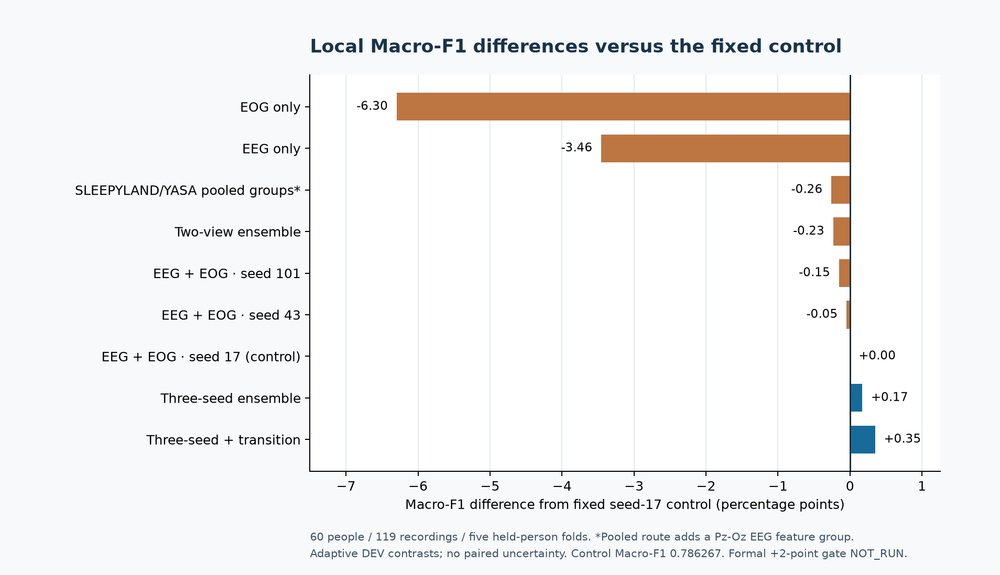
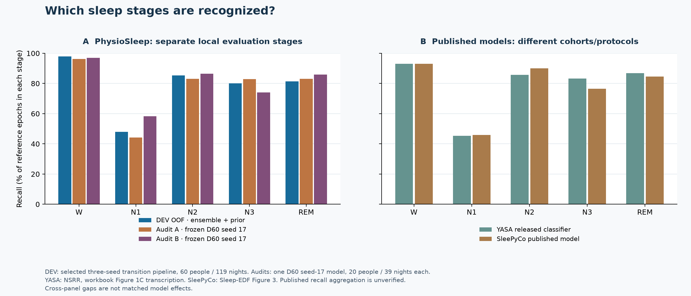

# How this repository relates to established sleep-staging code

[Local results](RESULTS.md) · [Mandatory comparator registry](BASELINES.md) · [Literature rows](../literature/COMPARISON.md)

This page compares **software purpose and our observed execution**, using the linked upstream repositories as primary sources. It is not a numeric leaderboard. A paper's reported score, a repository's available implementation and a matched run on our people are three different kinds of evidence.

| Upstream project | What its own repository provides | What PhysioSleep actually evaluated locally | Fair-comparison boundary |
|---|---|---|---|
| [YASA](https://github.com/raphaelvallat/yasa) | PSG analysis, physiological features and automatic staging, including a released pretrained classifier | **Locally trained** LightGBM on YASA EEG/EOG features: 0.786267 seed-17 development Macro-F1; a D60 refit scored 0.759022 / 0.798875 on Audit 1 / 2 | These numbers do **not** evaluate YASA's released pretrained classifier. The native YASA mandatory slot is incomplete. |
| [SLEEPYLAND](https://github.com/biomedical-signal-processing/sleepyland) | A framework for sleep-data analysis and evaluation of several staging models | Clean local SLEEPYLAND/YASA feature route: **0.783662** on the same 60-person development folds, with five saved-fold parity checks | It pools Fpz-Cz EEG+EOG and Pz-Oz EEG+EOG feature groups, so the channel inputs differ from our two-channel control. This is a development compatibility route, not proof that every packaged model was reproduced or beaten. |
| [U-Time / U-Sleep](https://github.com/perslev/U-Time) | Official training and evaluation software for U-Time and U-Sleep architectures | U-Sleep signal preparation and bounded numerical preflights; **no completed model fit**. The first U-Time inner fit failed at its state commit. | There is no matched local Macro-F1 to compare. Published U-Sleep results use their own datasets and protocol. |
| [AttnSleep](https://github.com/emadeldeen24/AttnSleep) | Attention-based single-channel EEG staging code, preparation and fold-training instructions | A local fold-0 training checkpoint reached **65/100 epochs**, then stopped | Training loss or a partial fold cannot be substituted for complete held-person predictions or a Macro-F1 result. |

PhysioSleep's strongest **completed development** pipeline averaged three locally trained EEG+EOG models and applied a prior fitted only on training people; it scored **0.789779** pooled Macro-F1. That is **+0.003512** over its fixed seed-17 control and **+0.006117** over the local SLEEPYLAND/YASA route on the same development people. It was **not** the model tested in Audit 1 or Audit 2. The formal eleven-slot comparison was stopped before completion, so no claim of superiority over the upstream algorithms follows.

## Completed local contrasts

The plotted quantity is `100 × (candidate pooled Macro-F1 − 0.7862669866)`, in percentage points. It uses **the same 60 development people, 119 recordings and 274,271 reference-valid epochs** as the fixed control. The selected transition pipeline's total difference is **+0.3512 points**; the three-seed ensemble without its transition prior is **+0.1722 points**. These are adaptive development contrasts, with no public participant-paired uncertainty estimate. The SLEEPYLAND/YASA pooled-groups route adds a Pz-Oz EEG feature group and is therefore not an isolated algorithm replacement. [Exact model rows and run IDs](../reports/judge-guide/local-comparison.json) · [Evaluation limits](RESULTS.md).

## Published algorithm context

The following *selected* values come from the supplied workbook's expanded Sleep-EDF sheet. They describe the authors' reported experiments; they are **not reruns on PhysioSleep's split**. Source URLs point to the primary papers. See the [full 56-setting transcription](../literature/COMPARISON.md) for other cohorts and row caveats.

| Published approach | Workbook Macro-F1 | Inputs and protocol recorded in workbook | What changes relative to our evaluated pipeline |
|---|---:|---|---|
| [AttnSleep](https://personal.ntu.edu.sg/ctguan/Publications/2021_Emad_IEEE_TNSRE.pdf), rows 8–9 | **75.1%** single epoch; **78.1%** three epochs | EEG; EDF-78 | An attention model with epoch context; our local fold-0 fit stopped at 65/100 epochs, so there is no matched local score. |
| [XSleepNet2](https://arxiv.org/pdf/2007.05492), row 10 | **78.7%** | EEG+EOG; expanded EDF with ±30-minute wake window | A learned two-modality network under different cropping and fold choices. |
| [SleepTransformer](https://arxiv.org/pdf/2105.11043), rows 11–12 | **74.3%** scratch; **78.8%** with SHHS pretraining | EEG; expanded EDF | Shows why training-data lineage matters: the higher workbook row includes external pretraining. |
| [SleePyCo](https://arxiv.org/pdf/2209.09452), row 13 | **79.0%** | EEG; paper's 79-subject expanded EDF setting | Contrastive representation learning and a different subject selection; no completed matched local run. |
| [SalientSleepNet](https://www.ijcai.org/proceedings/2021/0360.pdf), row 17 | **79.5%** | EEG+EOG; EDF-153 cross-subject setting | A neural multimodal system with a different cohort and fold design. |

All five rows above are **workbook transcriptions**. Selected paper tables were spot-checked against their primary PDFs, but the workbook extraction as a whole has not been independently reverified. The workbook percentages cannot be subtracted from our **78.9779%** development Macro-F1 to estimate an algorithm effect: participant membership, wake trimming, modalities, pretraining and aggregation vary. [Workbook extraction and row status](../literature/workbook-comparison.json) · [Why the native baseline slots remain incomplete](BASELINES.md).

## Stage-level context

The local panel recomputes recall as `100 × diagonal confusion count / reference-stage row total` from public aggregate matrices. **DEV** uses the selected three-seed transition pipeline; **Audit 1 and 2** use the frozen D60 seed-17 control on separate people. The literature panel transcribes [YASA's NSRR stage figure](https://elifesciences.org/articles/70092) and [SleePyCo's Sleep-EDF Figure 3](https://arxiv.org/pdf/2209.09452) from the workbook. YASA's N1 and N3 values and SleePyCo's five values were checked against article text/figure; the remaining YASA stage values and the published recall aggregation remain workbook-level evidence. These panels are deliberately separate: their vertical axes share units, but a difference across panels is not a matched model comparison. [Cell-level transcription](../literature/stage-recall-context.json) · [Our audited confusion matrices](../reports/exploratory-audits-v1/aggregate.json).

## What to inspect in a fair future comparison

Use identical participant membership, complete 30-second grids, five-class label order, reference-valid masks and pooled-count metric arithmetic. Verify each upstream code/weight license and training lineage, channel mapping, model-fit adequacy, checkpoint selection and prediction coverage. Participant-resampled **paired** differences and the predeclared +0.02 threshold would then address the historical gate; the original A/B people are already consumed, so confirmation needs fresh people. [Protocol and registry](BASELINES.md) · [Current decision](FINAL_REPORT.md#comparison-limitations-and-decision).

The supplied workbook's [56 experimental settings](../literature/COMPARISON.md) add research context, with row-level source attribution. Its cohorts, cropping, pretraining and aggregation vary, so its numbers cannot fill missing matched local results. No performance claim on this page comes from model memory alone.
