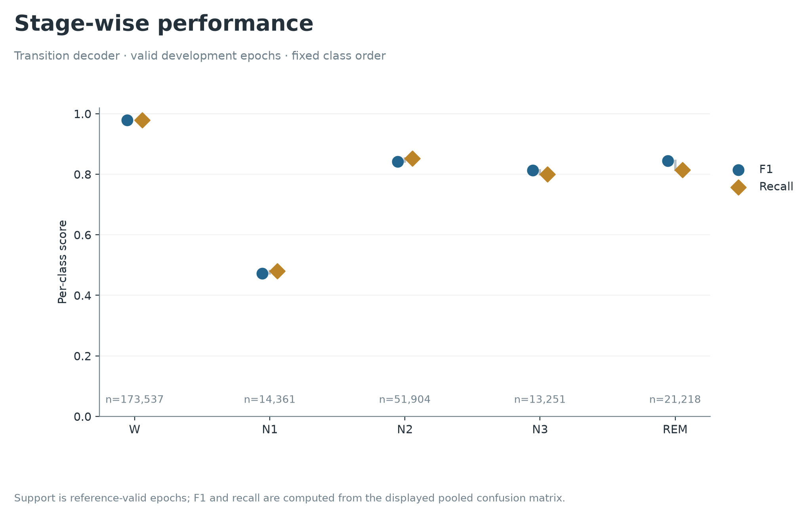

# Results: local staging, score fidelity and literature context

[Judge guide](JUDGE_GUIDE.md) · [Job ledger](EXPERIMENTS.md) · [Literature comparison](../literature/COMPARISON.md)

## Local staging comparison

These nine completed systems share **60 development participants, 119 recordings, five participant-disjoint folds and 274,271 reference-valid epochs**. Every complete epoch is predicted; 1,862 invalid reference epochs remain at their original times. Models and inputs differ, and development selection is adaptive. No row is an A/B test result.

| System | Physiological inputs | Macro-F1 | Accuracy % | Absolute F1 change vs fixed control |
|---|---|---:|---:|---:|
| EOG | EOG (1) | 0.723293 | 87.179 | -0.062974 |
| EEG | Fpz−Cz EEG (1) | 0.751696 | 88.991 | -0.034571 |
| EEG + EOG · seed 17 | Fpz−Cz EEG + EOG (2) | 0.786267 | 90.494 | +0.000000 |
| EEG + EOG · seed 43 | Fpz−Cz EEG + EOG (2) | 0.785769 | 90.474 | -0.000498 |
| EEG + EOG · seed 101 | Fpz−Cz EEG + EOG (2) | 0.784727 | 90.408 | -0.001540 |
| Two-view ensemble | Fpz−Cz EEG + EOG (2) | 0.783920 | 90.530 | -0.002347 |
| Three-seed ensemble | Fpz−Cz EEG + EOG (2) | 0.787989 | 90.590 | +0.001722 |
| Transition decoder | Fpz−Cz EEG + EOG (2) | 0.789779 | 90.738 | +0.003512 |
| Sleepyland/YASA pooled groups | Fpz−Cz + Pz−Oz EEG + EOG (3) | 0.783662 | 90.461 | -0.002605 |

[Download local results CSV](../reports/judge-guide/local-results.csv) · [Exact candidate confusion counts](../evidence/development-metrics.json) · [Sleepyland/YASA receipt](../evidence/sleepyland-yasa-development.json)

**The +0.02 requirement is unmet.** The best development gain is +0.003512 against the fixed control and +0.006117 against the later Sleepyland/YASA route. The figure's dashed line marks control +0.02 only, not the full multi-comparator gate. Participant-average Macro-F1 is 0.756066; pooled Macro-F1 is 0.789779. Those are different estimands.

## What the ablations taught us

| Change | Observed development finding | Interpretation |
|---|---|---|
| EOG alone → EEG+EOG | 0.723293 → 0.786267 | Two-channel route improves staging here; does not establish minimum sensors |
| EEG / EEG+EOG two-view mean | 0.783920, below fixed control | Adding a member can worsen results |
| Three fixed seeds averaged | 0.787989 | Small reproducible development gain, not confirmation |
| Add train-only transition prior | 0.789779; +0.001789 vs ensemble parent | Temporal structure helps modestly here |
| 100 → 400 boosting rounds | 0.782354 → 0.786267 | Best tested prefix is the endpoint; convergence is unresolved |

The [full report](REPORT.md#descriptive-uncertainty) gives 10,000-draw descriptive paired intervals and selection limitations. Training-seed variability is distinct from participant-bootstrap uncertainty.

## Stage performance and failure modes

N1 F1 is **0.4722**, while Wake F1 is 0.9786; Wake constitutes **63.27%** of valid epochs. Therefore 90.738% accuracy is not sufficient to establish clinically useful staging. The model is evaluated offline, including centered context and recording-local scaling. Output probabilities are classifier emissions, not transition-decoder posteriors or calibrated clinical certainty.

## Experimental score

The unchanged exploratory formula is `100 × sqrt(min(TST / 420 minutes, 1) × TST / SPT)`. It uses duration adequacy and continuity; it does not measure restorative sleep or diagnose disease. Eligibility requires at least seven hours of declared acquisition window, complete coverage and some sleep: **61/119 windows from 40/60 people**, with 58 windows ineligible. These are recording windows, not independently verified whole nights.

| System | Score MAE, points | TST MAE, min | Within-SPT WASO MAE, min |
|---|---:|---:|---:|
| EOG | 6.902 | 41.694 | 104.856 |
| EEG | 7.249 | 22.650 | 98.850 |
| EEG+EOG fixed control | 6.374 | 24.706 | 73.313 |
| Train-only constant | 7.839 | 46.231 | 101.606 |
| Three-seed + transition | 5.677 | 24.331 | 63.088 |
| Planned maximum | **5** | **15** | **10** |

All systems fail the joint targets. The new candidate has score bias +0.716 points and score P90 error 12.475 points, exceeding the ten-point P90 threshold. Its three paired MAE intervals against EEG+EOG include zero. [Full intervals and controls](../reports/score-extension/summary.json) · [Score CSV](../reports/judge-guide/score-results.csv) · [Independent verification](../evidence/score-extension-verification.json).

## Definitions judges should check

| Term | Meaning in this project |
|---|---|
| Macro-F1 | Mean of F1 for the fixed five classes after pooling valid-epoch confusion counts; a zero-denominator class contributes zero |
| N1 | Light transitional sleep stage; the weakest reported class |
| TST | Minutes scored as valid sleep |
| SPT | First sleep-epoch start through final sleep-epoch end |
| Within-SPT WASO | Wake minutes inside SPT, excluding terminal Wake |
| SE / SOL | SE requires valid independent time in bed; SOL requires an attempt-to-sleep anchor. Missing LightsOn is not replaced by recording end. |

All-Wake records have zero TST but undefined continuity/score. Missing intervals remain in coverage denominators. Agreement with the same formula applied to reference labels is not clinical validation.

## Published-model context

The [Excel comparison](../literature/COMPARISON.md) exposes all 56 supplied experiment rows and 31 source records. It uses separate tables because external cohorts, cropping, pretraining and aggregation differ. No cross-paper subtraction can satisfy our matched audit gate. [Mandatory baseline progress](BASELINES.md) remains distinct from both literature context and these completed development integrations.
